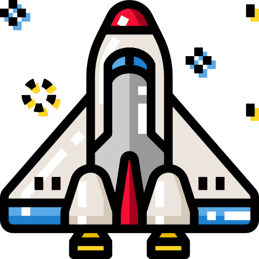
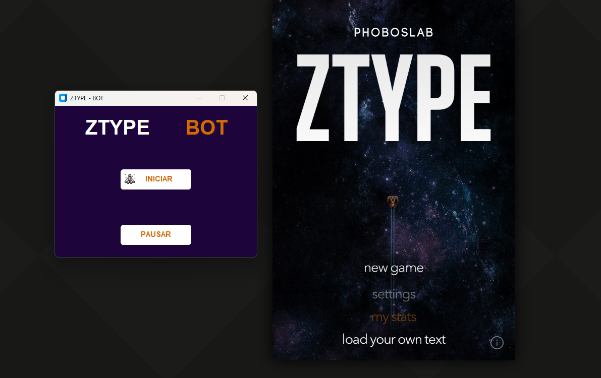
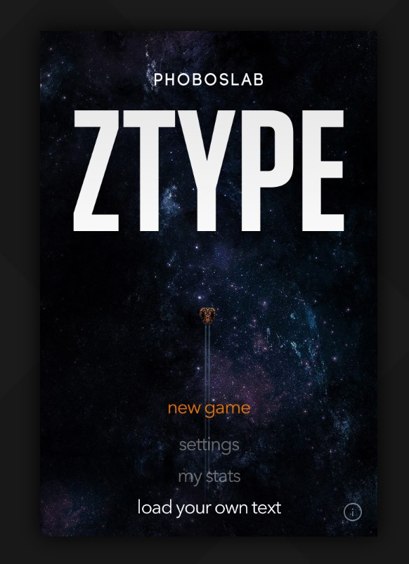

<div align="center">



# ZType Bot

**Bot para o jogo [ZType](https://zty.pe/): captura a área do jogo, lê as palavras com OCR e digita por você. Um estudo de reconhecimento de imagem e texto em Python.**




</div>

---

Projeto de estudo. O objetivo não é vencer o jogo, é entender na prática como funciona, e onde falha, um fluxo de captura de tela → OCR → ação em um cenário com movimento e fontes estilizadas.

## Como funciona

Em loop, enquanto o bot estiver ativo:

1. `pyautogui` tira um print de um **retângulo da tela**: a área do jogo.
2. `pytesseract` passa a imagem pelo **Tesseract OCR** e devolve o texto.
3. Cada palavra reconhecida é digitada com `pyautogui`.

Só isso. Não há leitura de memória nem interação com o site além de digitar.

## Requisitos

- Windows com Python 3.10 ou mais novo
- **Tesseract OCR** instalado. Baixe o instalador em [UB-Mannheim/tesseract](https://github.com/UB-Mannheim/tesseract/wiki) e anote o caminho do `tesseract.exe` (padrão: `C:\Program Files\Tesseract-OCR\tesseract.exe`)
- Pacotes em `requirements.txt`: customtkinter, pyautogui, pytesseract e Pillow

## Instalação

```bash
git clone https://github.com/Luis-lhgdf/ztype-botgame.git
cd ztype-botgame
pip install -r requirements.txt
```

## Configuração

No fim de `main.py` ficam o caminho do Tesseract e a área de captura:

```python
local = r"C:\Program Files\Tesseract-OCR\tesseract.exe"
application = Bot(executable_file_location=local, x=500, y=70, w=800, h=1000)
```

| Parâmetro | Significado |
|---|---|
| `local` | Caminho do `tesseract.exe` |
| `x`, `y` | Canto superior esquerdo da área do jogo, em pixels da tela |
| `w`, `h` | Largura e altura do retângulo capturado |

O retângulo precisa cobrir **só a área do jogo**. Se ficar maior, o OCR lê o texto do navegador em volta e o bot digita coisas erradas. Para descobrir as coordenadas, use o MouseInfo, que vem com o pyautogui:

```bash
python -c "import mouseinfo; mouseinfo.MouseInfoWindow()"
```

<div align="center">

<br><sub>O retângulo deve cobrir isto: a tela do jogo, sem a interface do navegador</sub>
</div>

## Como usar

1. Abra https://zty.pe/ e deixe o navegador em **tela cheia** (`F11`), para as coordenadas não mudarem.
2. Rode `python main.py`.
3. **INICIAR** liga o loop e **PAUSAR** desliga. O bot digita na janela em foco, então clique no jogo depois de iniciar.

## Estrutura

```
main.py            interface (customtkinter) e o loop captura → OCR → digitação
spacecraft.png     ícone do botão Iniciar
requirements.txt   dependências Python
docs/              prints usados neste README
```

O instalador do Tesseract não acompanha o repositório; baixe a versão atual no link acima. O `img.jpg` que aparece na pasta ao rodar é a última captura, e está no `.gitignore`.

---

## English

Bot for the typing game [ZType](https://zty.pe/), written as an image and text recognition study: it screenshots the game area with `pyautogui`, reads the words with Tesseract OCR through `pytesseract` and types them back. Requires Tesseract OCR installed on Windows and Python 3.10+; set the executable path and the capture rectangle at the bottom of `main.py`. **Interface is in Portuguese.**

```bash
pip install -r requirements.txt
python main.py
```

---

## Licença

MIT — veja [LICENSE](LICENSE).
